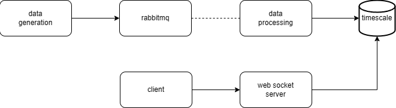

# Real-Time Analytics Platform

This project implements a real-time stock market visualization system with synthetic data generation, stream processing, and time-series storage. It uses RabbitMQ for message brokering, TimescaleDB for time-series data storage, and WebSockets for real-time client updates. The system is fully Dockerized.

1. [Introduction](#introduction)
2. [Architecture](#architecture)
3. [Prerequisites](#prerequisites)
4. [Setup and Installation](#setup-and-installation)
5. [Usage](#usage)
6. [Cleanup](#cleanup)

### Introduction

This system provides real-time visualization of synthetic stock market data through an interactive web interface. Key features include:

- Continuous generation of stock data
- Real-time data processing with financial indicators
- Historical data storage using TimescaleDB hypertables
- WebSocket-based updates to the React frontend

The technology stack includes:

| Component          | Technologies                            |
| ------------------ | --------------------------------------- |
| **Frontend**       | React, TypeScript, Chart.js             |
| **Backend**        | Node.js, Express, Socket.io, PostgreSQL |
| **Data Pipeline**  | RabbitMQ, TimescaleDB                   |
| **Infrastructure** | Docker, Docker Compose                  |

## Architecture



- **Data Generator**: Service producing synthetic stock data for 5 major symbols.
- **RabbitMQ**: Message broker handling data ingestion and queuing between components.
- **Data Processor**: Service that consumes raw data from RabbitMQ, computes financial metrics and persists results to TimescaleDB.
- **TimescaleDB**: Time-series database storing both raw ticks and processed analytics.
- **React Frontend**: Interactive dashboard with real-time updates via WebSocket.
- **WebSocket Server**: Service managing real-time client connections, pushing updates to the frontend.

## Prerequisites

- Docker (https://www.docker.com/)

## Setup and Installation

##### Step 1: Clone the repository

```bash
git clone https://github.com/petarkosic/real-time-analytics.git
cd real-time-analytics
```

##### Step 2: Configure environment variables

Rename `.env.example` to `.env` and fill in the values.

##### Step 3: Build and run the containers

```bash
docker compose up --build
```

## Usage

1. Access the application at `http://localhost:3000`.
2. Select a stock symbol from the dropdown to view its real-time data.
3. Choose timeframe.
4. View the chart and analytics.
5. Access rabbitmq management at `http://localhost:15672` (user: `RABBIT_DEFAULT_USER`, password: `RABBIT_DEFAULT_PASS`).

## Cleanup

To stop and remove the containers:

```bash
docker compose down
```
